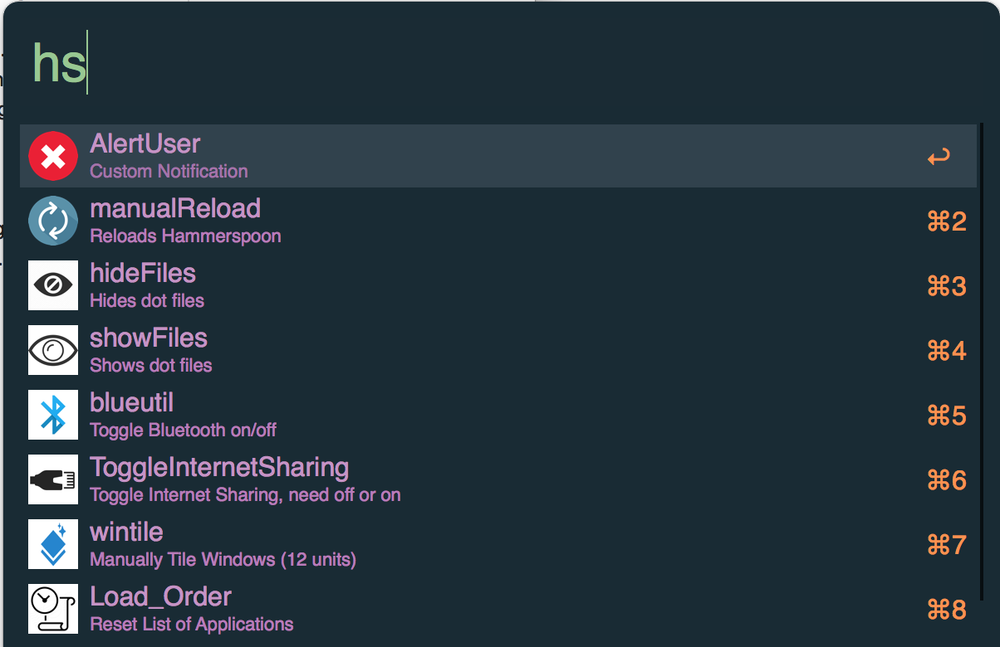

# Smart Hammerspoon - Alfred Workflow

This workflow calls an aptly-named function, ```AlfredFunction()```, which returns a user-defined list of functions and other arguments in a JSON format. The JSON is then parsed and searched to create a list of actionable items.

*Note: As this is a two-part program (part-Alfred & part-Hammerspoon), you should also checkout my [```.hammerspoon``` directory](https://github.com/KyleKing/My-Programming-Sketchbook/tree/master/Scripts/.hammerspoon), in particular the [```ini.lua``` file](https://github.com/KyleKing/My-Programming-Sketchbook/blob/master/Scripts/.hammerspoon/init.lua) for a complete example.*

For example, you can define this in your ```init.lua``` file:
```lua
-- make sure to have dkjson available in your .hammerspoon dir
local json = require('dkjson')

--------------------------------------------------
-- Global Utility Functions
--------------------------------------------------

local Utility = {}

-- Useful to send data from Hammerspoon to other applications
function Utility:printJSON(table)
    local ConvertedJSON = json.encode(table)
    -- Accounts for an array:
    print('{"wrapper":'..ConvertedJSON.."}")
end

--------------------------------------------------
-- Custom Alfred Triggers
--------------------------------------------------
-- Configure:
if ( hs.ipc.cliStatus() == false ) then
    hs.alert.show('Installing hammerspoon cli tool')
    hs.ipc.cliInstall()
end
-- Call by typing /usr/local/bin/hs -c 'hideFiles()' or just $ hs -c 'hideFiles()'

function AlfredFunctions()
    local sometable = {
        {
            ["func_name"]="AlertUser",
            ["description"]="Custom Notification",
            ["icon"]='icon.png',
            ["arg"]='string'
        }
    }
    Utility:printJSON(sometable)
end

--------------------------------------------------
-- Function to be Called by Alfred
--------------------------------------------------

function AlertUser(term)
  hs.alert.show(term)
end
-- AlertUser("it works")

```

Then in Alfred (if you have the Smart Hammerspoon workflow installed), you can type: ```hs ''' and a list of actions will appear:



You can further sort this list by typing: ```hs au```, which will narrow down the actions to only ones that matches that softsearch. For most cases you could then press enter and the function will trigger, but for this function, a argument is needed. To send an argument, simply type: ```hs au MyArgument```, which will display 'MyArgument', but you can also do: ```hs au My Argument```, which will display 'My Argument' because the workflow accepts any content after the second space to be a complete argument.

The options for declaring a function triggerable by Alfred are:

- ["func_name"]="The function name and title to appear in the Alfred item list",
- ["description"]="A short subtext to apear below the function name",
- ["icon"]='image path from within the alfred directory',
- ["arg"]='can be string, number, or none' (also optional and if left out, is assumed to be none)

## TODO

- [ ] Make the workflow more robust, because right now, you can trigger a function without an argument, even when it needs one to work
- [ ] Make adding custom images easier
- [ ] Account for variable paths to .hammerspoon directory (TODO make adding custom images easier - possibly make path to .hammerspoon/icons/*.png/jpg)
- [ ] Make package available on packal or otherwise make it installable by someone who isn't me
