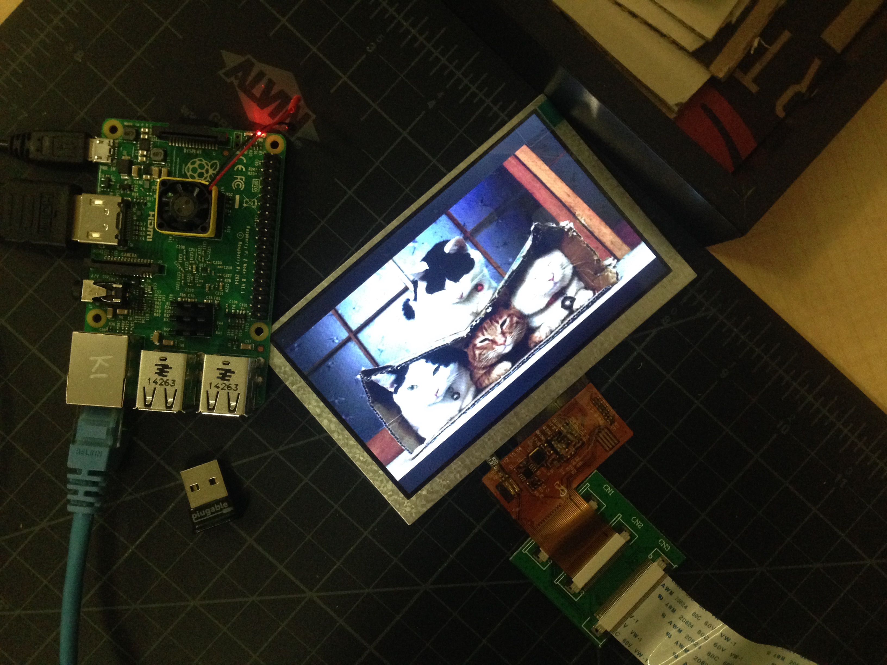

# Raspberry Pi Photo Frame Project

## What is it?

This is a Raspberry Pi program that downloads photos and displays them on any HDMI display. In my case, I setup a small HDMI display inside of a frame to create a really fancy smart photo frame.



The images are pulled from a special Dropbox folder that can be updated by [anyone with the passcode through the Baloon.io application](https://balloon.io/). To prevent unneccessary downloads, the script includes logic to download only new photos and delete old photos on a regular basis.
<!---->

The project has still progressed and the frame is starting to come together:


## How to install

1. Boot a Raspberry Pi with a fresh Jessie distribution, see the [Raspberry Pi website for a complete guide and download links]()
2. Copy this directory over to your Raspberry Pi (I don't know an easy free option off of the top of my head, but if you need help, please open an issue and I will find a soltion. I currently use Acrosync, which is paid)
3. Run Install.sh to install Node.js and FBI (Frame Buffer Image Viewer)

	For example:
	
	```bash
	chmod +rwx ./Install.sh;
	bash Install.sh;
	```
4. You should now be up to date, so time to setup Balloon.io and upload a few test images.
5. Back on the Raspberry Pi, you'll need one final installation, which can be accomplished by running ```npm install``` inside of the copied directory. This will install all of the NPM packages listed in the package.json file
6. Configure Dropbox access token and Secret.json:
	
	```js
	Follow Dropbox authentication process:
	// Step 1:
	// Copy request_token into SecretOptions and then visit URL to grant approval
	app.requesttoken(function(status, request_token){
	  console.log(request_token)
	  console.log(request_token.authorize_url)
	})
	console.log(SecretOptions.request_token);
	// Step 2:
	// Comment out above snippet and load save value
	app.accesstoken(SecretOptions.request_token, function(status, access_token){
	  console.log(access_token)
	})
	// Step 3:
	// Copy Access Token into secret.json
	```
7. Once the Secret.json file is setup, run ```node PhotoFrame.js``` and images should start downloading
8. If this all works, amazing! you might be the first to try to install this! If not, please open an issue and I will try to help you out! Otherwise, time to move onto setting up the iamges to start on boot (scroll down a bit further)

## PS There are a few steps missing

You need to change the route to the Balloon.io file and set other settings. A full secret.json file would be very helpful

Include a quick guide to install the necessary files and such

Also should mention Wifi

## How to Start Slideshow on Boot

Go to your etc directory and create a new file:

```bash
cd /etc/init.d/
sudo nano PhotoFrameStart
# Make sure above code is accurate ^ then close and save
```

Make sure the file has this information (copy/paste):

```bash
#!/bin/sh
### BEGIN INIT INFO
# Provides:          PhotoFrameStart
# Required-Start:    $remote_fs $syslog
# Required-Stop:     $remote_fs $syslog
# Default-Start:     5
# Default-Stop:      6
# Short-Description: Will this work?
# Description:       This file should be used to construct scripts to be
#                    placed in /etc/init.d.  This example start a
#                    single forking daemon capable of writing a pid
#                    file.  To get other behavoirs, implemend
#                    do_start(), do_stop() or other functions to
#                    override the defaults in /lib/init/init-d-script.
### END INIT INFO
cd /home/pi/Documents/PhotoFrame/; node PhotoFrame.js
```

Save and close, then make the file executable and test that it works properly:

```bash
sudo chmod 755 PhotoFrameStart
sudo update-rc.d PhotoFrameStart defaults

bash /etc/init.d/PhotoFrameStart # Check the script
```

If successful, restart the Raspberry Pi ```sudo shutdown now -r``` and see if it all works!


To make additional edits, this shorthand command will be useful:

```bash
sudo nano /etc/init.d/PhotoFrameStart
```


## Acknowledgements

[This guide](http://www.ofbrooklyn.com/2014/01/2/building-photo-frame-raspberry-pi-motion-detector/) served as a basis for most of what I built
