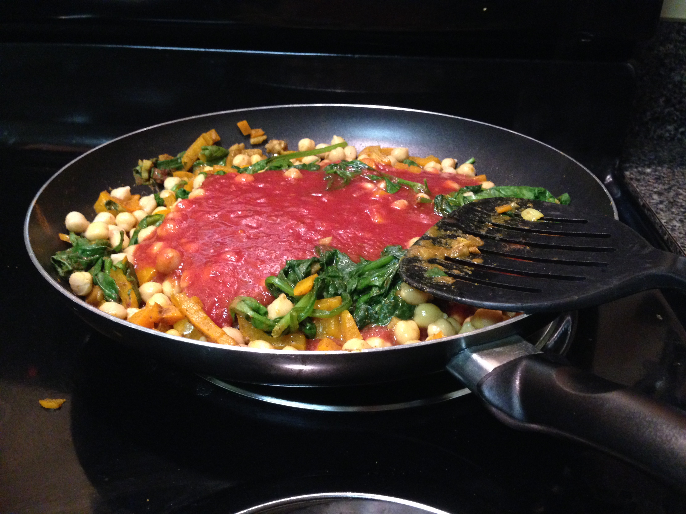
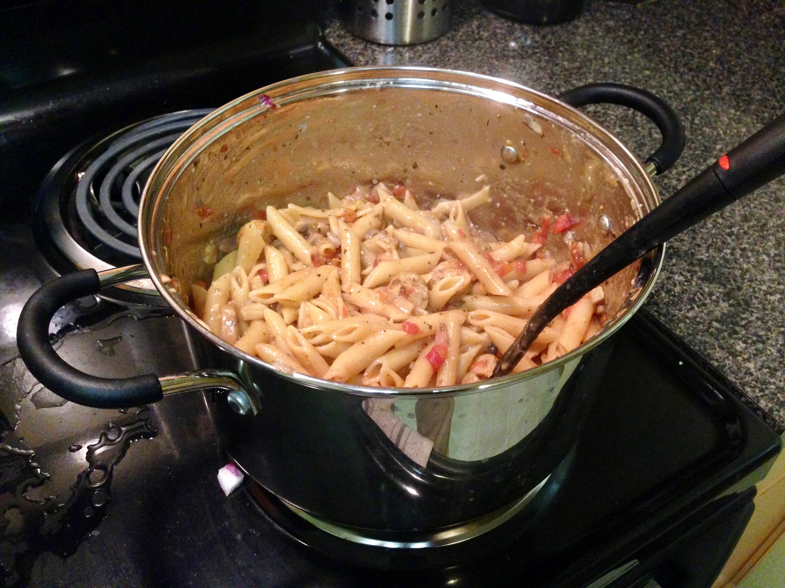

# My Go To Recipes

<!--
# TODO:
- Oreo Truffles
- Cake Pops
-->

<!-- See ideas for [Breakfast](Breakfast.md), [Lunch](Lunch.md), or [Dinner](Dinner.md) -->

<!--
## Shrimp Tacos

TODO

## Cashew Chicken

TODO

## Tuna Melts

TODO
-->

## Black Bean Quesadillas

TODO

## Dragon Noodles

TODO

## Cocoa-Peanut Butter Smoothie

TODO

## Curried Chickpeas

  

<!-- 
The prototype alarm
 -->

- 1 Small Onion
- 1.5 Tbsp Curry Powder
- 1 tsp cinnamon, nutmeg, sugar, or 1" fresh ginger
- 1/4 tsp Garlic Powder (or 2 cloves)
- 8 oz (bag) of spinach
- 15 oz can tomato sauce
- 29 oz can of chickpeas/Garbanzo beans
- + rice / naan / etc.

1. Start cooking the rice and rinse and drain the chickpeas
2. In a large skillet on medium heat, sauté  the diced onion for 4 minutes with a small amount of olive oil
3. Add the garlic powder, curry powder and cook for an additional minute
4. Add 1/4 cup water and all of the spinach
5. Once the spinach has wilted, add the tomato sauce and garbanzo beans. Cook for 5 more minutes

(Source: http://www.budgetbytes.com/2013/12/curried-chickpeas-spinach/)

## Sausage and Mushroom Penne Pasta

  

- 3 Links Italian Sausage
- 1 Small Onion
- 8 oz. Container of Button Mushrooms
- 28 oz. can of crushed tomatoes
- 1/2 tsp Garlic Powder
- 1 tsp basil
- 1 tsp oregano
- 1 lb box of Penne / rigatoni
- 1/4 cup Parmesan
- Chopped parsley (optional)

1. Dice the onion, wash and slice the mushrooms, and gather the other ingredients.
2. In a large pot, cook the sausages in a small amount of olive oil on medium heat until brown on the outside and firm (if precooked just skip this step) . Remove with tongs and slice into rounds - return to the pot to brown for a few minutes
3. Once the sausage rounds are browned, add the canned tomatoes, onion, garlic powder, mushrooms, basil, and oregano - stir!
4. Add about 3.5 cups of water and the box of pasta. Place a lid on and bring the pot to a rapid boil
5. As soon as it reaches a full boil, stir, replace the lid, then turn the heat down to low to simmer (~25% - 35%). Stir every five minutes and if at 15 minutes there is too much liquid, take off the lid and let simmer for slightly longer. Once ready, add the Parmesan and top with chopped parsley, if desired.

(Source: http://www.budgetbytes.com/2014/04/one-pot-sausage-mushroom-pasta/)

## Peanut Noodles

  

- I recommend Egg Noodles, Fettuccine, or Rice
- Chopped baby carrots
- Chopped shallots (a.k.a. white base of green onion)
- *Green pepper (optional)*
- *Broccoli (optional)*
- *Snow peas (optional)*

Sauce:

- 5 tbsp PB
- 1 tbsp hot chili oil
- 2 tsp sesame oil
- 6 tbsp soy sauce
- 2 tsp cider vinegar (or white wine/rice vinegar)
- 3 tsp cinnamon, nutmeg, or ginger

Garnish Options (I wouldn't recommend all at once):

- **Sesame seeds**
- **Peanuts**
- Lime Juice and Zest
- Cilantro
- Sriracha
- Garlic
- Honey?
- *Can be served with shrimps marinated in lime, salt, and garlic powder then sautéed

1. Mix the sauce until smooth and prep all the vegetables
2. Boil the pasta, drain, then immediately toss with the sauce and vegetables. Add the garnish and serve!

(Original Source: My Coworkers Dani and Michael)

## Fajitas

  

Main:
- 3 Peppers
- 3 Tomatoes
- 1 Lg. Onion
- Can of Corn
- Can of Black Beans
- 1 lb. Chicken (~two breasts)

Seasonings:
- 1 Tbsp chili powder
- 2 Tbsp vegetable oil
- ¼ tsp garlic powder
- ½ Tbsp corn starch
- ¼ tsp cumin*
- ⅛ tsp cayenne pepper*
- ½ tsp onion powder*

Toppings:
- 10 6-inch tortillas
- 1/3 bag of spinach
- 1/2 jar of Salsa
- Cilantro
- Green onions
- 1 medium lime

1) Defrost the chicken and preheat the oven to 400 degrees
2) Cut the peppers, onions, tomatoes, and chicken into 1/4" strips and fill a 9 x 13" casserole dish. Add the beans and corn, then cover with the seasonings and olive oil. Mix by hand
<!-- (FIXME^) -->
3) Bake for 30 minutes, while baking start the rice, so they finish around the same time
4) Make sure to crisp the tortillas in a pan so everything can be served hot!

(Original Source: http://www.budgetbytes.com/2013/02/oven-fajitas/)

## Orzo n' Cheese

  

- 16 oz Box of orzo
- *4 cups of chicken broth (optional)*
- 1 lb Ham steak, cubed
- 1 cup Parmesan cheese, shredded or grated
- 3/4 cup skim milk
- Bag of frozen broccoli

1) Heat chicken broth and two cups of water to boil with a bit of olive oil
2) Crisp cubed ham in a hot sauce pan
3) Toss the orzo in, then for the last two minutes of cook time, add the broccoli
4) Drain, then add the milk and Parmesan to the drained orzo in the big pot. Sit on low heat until combined
5) Add the crisped ham and pepper for taste

(Original Source: http://exploitsofamilitarymama.com/2012/08/slutty-orzo/)

## Easy Chicken Prep

1. Defrost chicken in hot water or in microwave (~10 min)
2. Preheat oven to 350℉ (~10 min)
3. Cover chicken in olive oil and spices (typically salt and pepper)
4. Place in oven on tin foil covered platter for 15 minutes
5. Flip and bake for 12 minutes

(Or 400°F - 20 minutes total / flip around 14 minutes)

Serve on rice, as a sandwich, etc. Leftovers are easy to add to pasta in tomato sauce

## Easy Rice and Vegetables

- Cans each of Corn, Tomatoes, and Black Beans

1. Start cooking rice
2. Rinse and drain the three cans and in a large tupperware, heat them in a microwave until warm.
3. Serve everything together with curry powder, red pepper flakes, Sriracha, or other spice