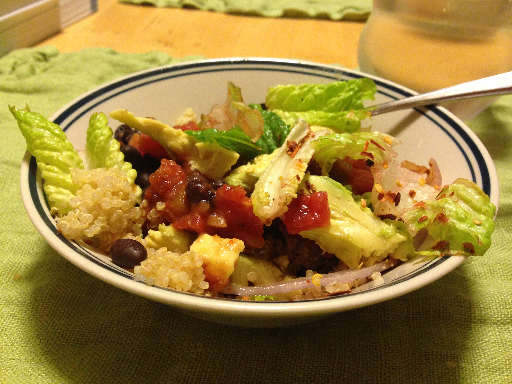
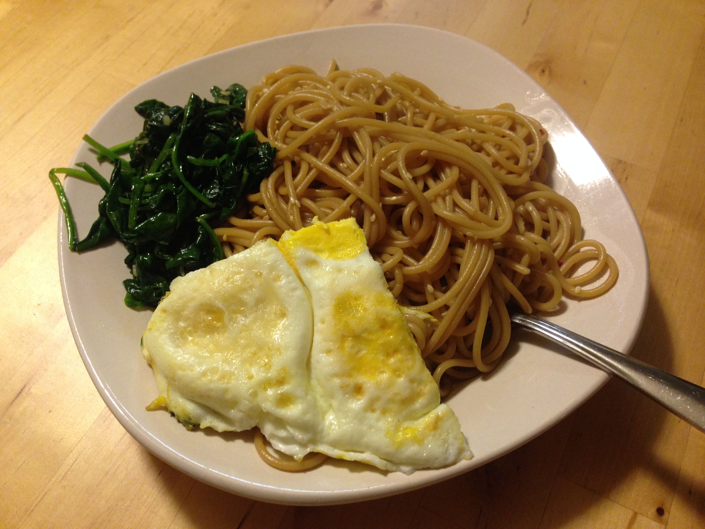

# My Go To Recipes

<!-- MarkdownTOC depth="6" autolink="true" bracket="round" -->

- [Easy Quinoa & Stuff](#easy-quinoa--stuff)
- [Curried Chickpeas](#curried-chickpeas)
- [Sausage and Mushroom Penne Pasta](#sausage-and-mushroom-penne-pasta)
- [Peanut Noodles](#peanut-noodles)
- [Fajitas](#fajitas)
- [Orzo n' Cheese](#orzo-n-cheese)
- [Basic Chicken Prep](#basic-chicken-prep)
- [Dragon Noodles](#dragon-noodles)
- [Sesame Noodles With Wilted Greens](#sesame-noodles-with-wilted-greens)
- [Slow Cooker Thai Chicken and Noodles](#slow-cooker-thai-chicken-and-noodles)
    - [TODO - See link](#todo---see-link)
- [Slow Cooker Chicken and Dumplings](#slow-cooker-chicken-and-dumplings)
    - [TODO](#todo)
- [Pasta + Mozzarella](#pasta--mozzarella)
- [Oatmeal Balls](#oatmeal-balls)
- [Cashew Chicken](#cashew-chicken)
    - [TODO - See link](#todo---see-link-1)
- [Oreo Truffles](#oreo-truffles)
- [Tuna Melts](#tuna-melts)
    - [TODO](#todo-1)
- [Black Bean Quesadillas](#black-bean-quesadillas)
    - [TODO](#todo-2)
- [Cocoa-Peanut Butter Smoothie](#cocoa-peanut-butter-smoothie)
- [Molten Chocolate Cake](#molten-chocolate-cake)
    - [TODO](#todo-3)
- [General Tso's Chicken](#general-tsos-chicken)
    - [TODO - See link](#todo---see-link-2)
- [Egg Salad Sandwich](#egg-salad-sandwich)
- [Thai-Spiced Pork and Rice Noodle Stir-Fry](#thai-spiced-pork-and-rice-noodle-stir-fry)
    - [TODO - See link](#todo---see-link-3)
- [Caramel Rice Krispies Bar](#caramel-rice-krispies-bar)
- [Lemon Poppy Seed Mini Scones](#lemon-poppy-seed-mini-scones)
- [Hot Fudge Sauce](#hot-fudge-sauce)
- [Slow Cooker Chicken Tortilla Soup](#slow-cooker-chicken-tortilla-soup)
- [Shrimp Tacos](#shrimp-tacos)
- [Cake Pops](#cake-pops)

<!-- /MarkdownTOC -->

## Easy Quinoa & Stuff

1. Prepare Quinoa and (Optional) sautée peppers and onions
2. Microwave a can each of black beans, tomatoes, and corn in a large tupperware
3. Mix everything together with your choice(s) of red pepper flakes, curry powder, Sriracha, salsa, avocado, lettuce, etc

  

## Curried Chickpeas

- 1 Small Onion (or diced pepper)
- 1.5 Tbsp Curry Powder
- 1" fresh ginger or 1 tsp cinnamon or 1 tsp nutmeg
- 1/4 tsp Garlic Powder (or 2-3 fresh cloves)
- 8 oz (full bag) of spinach
- 15 oz jar of tomato sauce
- 29 oz can of chickpeas/Garbanzo beans
- rice / naan / etc.

1. Start cooking the rice and rinse & drain the chickpeas
2. In a large skillet on medium heat, sauté the diced onion for 4 minutes with a small amount of olive oil
3. Add the garlic powder, ginger (cinnamon), and curry powder then cook for an additional minute
4. Add 1/4 cup water and all of the spinach
5. Once the spinach has wilted, add the tomato sauce and garbanzo beans. Cook for 5 more minutes

  

(Source: http://www.budgetbytes.com/2013/12/curried-chickpeas-spinach/)

## Sausage and Mushroom Penne Pasta

- 3-6 Links Italian Sausage
- 1 Small Onion
- 8 oz. Container of Button Mushrooms
- 28 oz. can of Crushed Tomatoes
- 3 Cloves of Garlic (1/2 tsp Garlic Powder)
- 1 tsp Basil
- 1 tsp Oregano
- 1/4 cup Parmesan
- 1 lb box of Penne / Rigatoni
- Chopped parsley (optional)

1. In a large pot, cook the sausages in a small amount of olive oil on medium heat until brown on the outside and firm {~5 minutes} (if precooked just skip this step)
2. Dice and prep the garlic, onions, and mushrooms. In parallel turn the heat off on the browning sausage to let cool
3. Using tongs, remove and slice the sausage into rounds. Toss the rounds back in for 4 minutes or until brown
4. Add the canned tomatoes, basil, oregano, garlic, onions, and mushrooms, then 3.5 cups of water and the box of pasta
5. With a lid, bring the pot to a rapid boil. Once boiling, stir, replace the lid, and simmer (~30%)
6. Stir the pot every five minutes while simmering. After 15 minutes if too much water is left, remove the lid and let simmer for slightly longer

  

(Source: http://www.budgetbytes.com/2014/04/one-pot-sausage-mushroom-pasta/)

## Peanut Noodles

- Linguine, Egg Noodles, or Rice
- Chopped baby carrots
- Chopped shallots (a.k.a. white base of green onion)
- *Other vegetables: Peppers, Broccoli, Zucchini, Snow Peas*

Sauce:

- 6 Tbsp PB
- 1.5 Tbsp hot chili oil
- 2 Tbsp sesame oil
- 7 Tbsp soy sauce
- 2 tsp cider vinegar (or white wine/rice vinegar)
- 1" fresh ginger or 1.5 tsp cinnamon, nutmeg, or sugar

Garnish Options:

- Sesame seeds or Peanuts
- Green onions
- Cilantro
- *Can be served with shrimps marinated in lime, salt, and garlic powder then sautéed

1. Mix the sauce until smooth and prep the vegetables separately
2. Boil the pasta, drain, then immediately toss with vegetables and sauce

  

(Original Source: My Coworkers Dani and Michael)

## Fajitas

Main:

- 3 Peppers
- 3 Tomatoes
- 1 Lg. Onion
- Can of Corn
- Can of Black Beans
- 1 lb. Chicken (~two breasts)

Seasonings:

- 1 Tbsp chili powder
- 2 Tbsp vegetable oil
- ¼ tsp garlic powder
- ½ Tbsp corn starch

With:

- 10 6-inch tortillas
- 2 cups of Rice
- 1/3 bag of spinach
- 1/2 jar of Salsa
- Fresh lime
- Cilantro

1) Defrost the chicken and preheat the oven to 400 degrees
2) Cut the peppers, onions, tomatoes, and chicken into 1/4" strips and fill a 9 x 13" casserole dish. Add the beans and corn, then cover with the seasonings and olive oil. Mix by hand
3) Bake for 30 minutes and start the rice
4) Crisp the tortillas in the pan so everything can be served hot!

  

(Original Source: http://www.budgetbytes.com/2013/02/oven-fajitas/)

## Orzo n' Cheese

- 1 lb Ham steak, cubed
- 16 oz Box of orzo
- Bag of frozen broccoli
- 1 cup Parmesan cheese, shredded or grated
- 3/4 cup skim milk

1) Crisp cubed ham over medium-high heat and in parallel, bring a large pot of water to boil
2) In the pot, cook the orzo and for the last two minutes, add the frozen broccoli
3) Drain and return the orzo and broccoli to the pot. Stir on low heat with the milk, Parmesan, and crisped ham

  

(Original Source: http://exploitsofamilitarymama.com/2012/08/slutty-orzo/)

## Basic Chicken Prep

1. Preheat oven to 350℉ (~10 min)
2. Cover chicken in olive oil and spices (typically salt and pepper)
3. Place in oven on tin foil covered platter for 15 minutes
4. Flip and bake for 12 minutes

(Or 400°F - flip around 14 minutes then 6 cook for 6 more minutes)

Optional Seasonings:

- Tacos: chili powder + cumin + cayenne + paprika
- Rice: Sriracha + honey (+ broccoli)
- Sun-Dried Tomato: minced garlic + olive oil + sun-dried tomato paste
- Korean: gochujang (Korean chili paste) + mayonnaise + sesame oil
- Coconut Rice Noodle Curry: Thai curry paste + coconut oil
- Barbecue: barbecue sauce with a side of mashed potatoes

  

(Source: https://www.craftsy.com/blog/2014/04/baked-chicken-breast-recipe/)

## Dragon Noodles

- 16 oz Bag of Lo Mein Noodles
- 2 tbsp butter
- 1 tsp of red pepper flakes
- 3 eggs
- Sliced green onions or zucchini (which is better than you might think)
- 3 tbsp soy sauce
- 3 tbsp Sriracha
- Cilantro

1) Start the lo mein noodles in a pot for 5-7 minutes (see instructions) and start melting 2 tbsp of butter in a large skillet
2) When the butter melts, add the red pepper flakes and zucchini or green onion
3) After a few minutes, add the three eggs to the skillet and keep on medium heat until cooked
4) When the lo mein noodles finish, add them to the skillet and add the Sriracha and Soy Sauce on top. Mix everything up and heat for a few additional minutes

  

(Source: https://www.budgetbytes.com/2012/08/spicy-noodles/)

## Sesame Noodles With Wilted Greens

- 8 oz Spaghetti
- 1/2 bag of spinach (4 oz)
- 2 eggs
- olive oil
- 2 minced cloves garlic
- 1/4 cup soy sauce
- 1 tbsp toasted sesame oil
- 1/3 tbsp cider vinegar (or 1/2 Tbsp rice vinegar)
- 1 tbsp sesame seeds
- 1/2 tbsp red pepper flakes

1. Combine soy sauce, sesame oil, cider vinegar, sesame seeds, red pepper flakes, and half of the garlic in a small bowl then set aside {start a large pot of water to boil}
2. In a large skillet over medium heat, sauté the other half of the garlic in olive oil (about 1 min). Then add the spinach and sauté until wilted (the spinach should still be bright green and look slightly plump). Season with salt and pepper and remove from heat.
3. Once boiling, cook the pasta, drain, then with the heat off, mix the sauce and pasta. Keep the lid on to keep the pot warm
4. Prepare the eggs however you like (fried sunny side up, over hard, poached, scrambled, or soft boiled), then combine and serve!

  

(Source: https://www.budgetbytes.com/2016/05/sesame-noodles-wilted-greens/)

## Slow Cooker Thai Chicken and Noodles

- 8 oz dry rice noodles
- 2 lbs skinless chicken breast, cubed
- 2 tbsp olive oil
- 14 oz light coconut milk
- 2 tbsp red curry paste
- 1/4 cup creamy natural peanut butter
- 1/4 cup soy sauce
- 2 tbsp brown sugar
- 1/2 white onion, sliced
- 2 minced cloves garlic
- 1 sliced green pepper
- 6 thai chili peppers, seeded

Toppings:

- Juice of 1 lime
- 4 sprigs green onion
- 1/4 cup bean sprouts
- 1/4 cup cilantro
- 1 handful dry roasted peanuts, chopped

### TODO - See link

  

(Source: http://hostthetoast.com/slow-cooker-thai-chicken-and-noodles/)

## Slow Cooker Chicken and Dumplings

- 2 cloves garlic
- 1 medium yellow onion
- 3 ribs celery
- 1/2 lb (3-4) carrots
- 1 large (3/4 lb.) chicken breast
- 1 whole bay leaf
- 1 tsp dried basil
- 1 tsp dried thyme

Dumplings:

- 1½ cups all-purpose flour
- 1½ tsp baking powder
- ½ tsp salt
- ½ Tbsp dried parsley
- 6 Tbsp cold butter
- ¾ tsp sugar
- ⅔ cup milk

### TODO

  

(Source: https://www.budgetbytes.com/2013/10/slow-cooker-chicken-dumplings/)

## Pasta + Mozzarella

- Box of pasta
- Bag of Frozen peas
- Pesto
- Red pepper flakes
- Mozzarella ball
- 1 Tomato

1. Boil the pasta following the directions, then for the last two minutes, add the frozen vegetable to the boiling pasta
2. Drain and return to the pot - immediately mix with pesto and red pepper flakes and wait to slightly cool
3. Serve the pasta and top with the diced tomato and mozzarella!

Note: if the mozzarella is added to hot pasta it will melt and get stringy, so store it separately, which will make reheating the pasta easier

  

## Oatmeal Balls

- 1 cup rolled oats
- 1/2 cup Chocolate Chips
- 1/2 cup ground Flaxseed Meal
- 1/2 cup Peanut Butter
- 1/3 cup maple syrup (or honey)
- 1 tsp vanilla extract

1) Combine all ingredients in one bowl then form into balls and freeze

  

(Source: the back of a milled flaxseed bag)

## Cashew Chicken

### TODO - See link

(Source: LINK)

## Oreo Truffles

- See link

(Source: LINK)

## Tuna Melts

- Ingredients

### TODO

  

(Source: LINK)

## Black Bean Quesadillas

- Ingredients

### TODO

  

(Source: LINK)

## Cocoa-Peanut Butter Smoothie

- yogurt
- 1-2 spoons of of pb
- banana
- spoon of cocoa powder
- and some water to thin the mixture

1. Blend

  

## Molten Chocolate Cake

- 1 tablespoon unsalted butter, melted
- 1 70% dark chocolate bar (100g)
- 7 tablespoons unsalted butter, cut into cubes
- 2 eggs and 2 egg yolks, room temperature
- 1/2 cup sugar
- 2/3 cup and 2 tablespoons flour
- 1/8 teaspoons salt
- For dusting, Powdered sugar and Cocoa powder

### TODO

  

(Source: http://spoonuniversity.com/recipe/valentines-chocolate-cake)

## General Tso's Chicken

- 2 chicken breasts
- 3/4 cup jasmine rice
- 4 ounces snowpeas
- 4 gloves garlic
- 2 scallions
- 2 tbsp soy glaze
- 1 tbsp sambal oelek
- 1 tbsp sesame oil
- 1/2 cup cornstarch
- 1/4 cup ketchup

### TODO - See link

  

(Source: https://www.blueapron.com/recipes/general-tso-s-chicken-with-sauteed-snow-peas-jasmine-rice / Blue Apron)

## Egg Salad Sandwich

- 1-2 Hard-Boiled Eggs, peeled
- Spoonful of mayonnaise
- 1 tbsp fresh lemon juice
- 1 tbsp yellow mustard
- 2 tbsp finely chopped celery
- 1 tbsp thinly sliced green onions
- lettuce, pepper

1. **Hard Boil the eggs**: Place in saucepan large enough to hold eggs in one layer. Cover in water by 1 in and heat on high until boiling, then quickly remove from the burner and cover pan. Let sit for 9:**12**:15 for MD-XL sized eggs. See notes on peeling below
2. **Sandwich**: Mix mayo, lemon juice, mustard, salt and pepper in a medium bowl. Then add chopped eggs, celery and green onions. Refrigerate to blend flavors before serving

Egg Advice:

- Choose eggs that are 10+ days old, which will be easier to peel
- Allow to cool before peeling
- Tap gently on counter top until evenly cracked, roll the egg between hands to loosen the shell, then peel under cool water
- If left int he original shell, eggs can be stored for up to one week

  

(Source: http://www.incredibleegg.org/recipe/simple-egg-salad-sandwich/)

## Thai-Spiced Pork and Rice Noodle Stir-Fry

- 12 oz Rice Noodles
- 4 Scallions
- 12 oz Mini Bell Peppers
- 1 Lime
- 16 oz Ground Pork
- 2 tsp Thai Seasoning
- 8 oz Red Cabbage
- 2 tbsp Soy Sauce
- 2 Pork Ramen Stock Concentrate
- 2 tbsp Sesame Oil
- 2 oz Peanuts

### TODO - See link

  

(Source: https://ddw4dkk7s1lkt.cloudfront.net/card/w12-r3-7e247e15.pdf / Hello Fresh Meal Service)

## Caramel Rice Krispies Bar

Caramel Sauce

- 14 oz bag of caramels (unwrapped)
- 14 oz can sweetened condensed milk
- Stick of butter

Da'Krispies

- 1.5 sticks butter
- 10 cups miniature marshmallows
- 10 cups rice Krispies

1. Combine **half of the** caramels, half of the condensed milk, and a half stick of butter and microwave for 2 minutes. Stir and continue to heat until smooth
2. In another bowl, melt 6 tbsp butter with 4 cups marshmallows for 70s. Stir until smooth and pour over 5 cups of cereal - stir until coated
3. Place in a greased 9x13 inch glass dish and sprinkle two cups of marshmallows over cereal mixture, then carefully pour caramel over top.
4. Refrigerate to cool, then repeat to make the second layer with the rest of the ingredients. Refrigerate until entirely firm

  

## Lemon Poppy Seed Mini Scones

- 1 fresh lemon, *for 1 tsp zest and 1 tbsp juice*
- 1.25 cups all-purpose flour
- 1/2 tsp salt
- 3/4 cup powdered sugar, divided
- 2 tsp baking powder
- 2 tsp poppy seeds
- 1 cup heavy whipping cream

1. Preheat oven to 400ºF and line a baking sheet with parchment. Prep the lemon and place the zest and juice separately to the side
2. In a large bowl, stir together the flour, salt, *1/4* cup powdered sugar, baking powder, poppy seeds, and 1 tsp lemon zest
3. Stir the cream into the dry ingredients until a shaggy ball of dough forms. The dough will be fairly sticky. Turn the dough out onto a floured surface, divide it into three pieces, and shape each piece into a disc (about 3 inches diameter). Cut each disc into six triangles.
4. Arrange the cut scones on the prepared baking sheet. Bake the scones for about 15 minutes, or until they just begin to barely turn golden brown on top.
5. While the scones are baking, place the remaining ½ cup powdered sugar in a bowl. Stir in about 1 Tbsp lemon juice, or just enough to form a thick glaze.
6. When the scones have baked, remove them from the oven, let them cool, then drizzle with the prepared lemon glaze.

  

(Source: https://www.budgetbytes.com/2017/03/lemon-poppy-seed-two-bite-scones/)

## Hot Fudge Sauce

- 2 oz unsweetened chocolate
- 1 tbsp butter
- 1/3 cup boiling water
- 1 cup sugar
- 2 tbsp corn syrup
- 1 tsp vanilla

1. Melt the chocolate and butter then add the boiling water.
2. Stir well and add the sugar and corn syrup
3. Once well mixed, let the mixture boil (but not too furiously). Maintain a boil for 3.5 - 4 minutes without stirring
4. Reduce heat to a simmer for a final minute

  

(Source: Aloo)

## Slow Cooker Chicken Tortilla Soup

Soup

- 4 chicken breast, halved
- 2x 15 oz cans of black beans, drained
- 2x 15 oz cans of Mexican stewed tomatoes or Rotel tomatoes
- 1 cup salsa
- 4 oz chopped green chilies
- 14.5 oz can tomato sauce

Toppings

- Tortilla chips
- 2 cups grated cheese

1. Combine all soup ingredients in large slow cooker, then cover and cook on low for 8 hours
2. Just before serving, slice the chicken breasts into bite size pieces and return to soup

  

(Source: Becky Harder - Monument, CO)

## Shrimp Tacos

- asdf

1. TODO

  

(Source: LINK)

## Cake Pops

Bake a cake according to the instructions and then once it's completely cooled, crumble the cake and mix in a container of frosting! And then dip in melted chocolate if desired

  

<!-- ## Archive:
- Kraft Mac and Cheese (2 tbsp. butter and 1/3 cup milk!)
-->