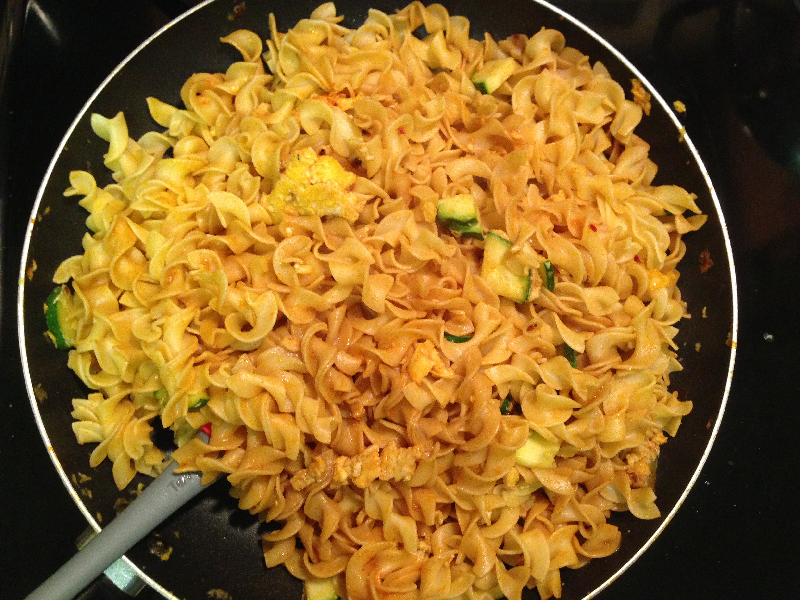

# My Go To Recipes

<!-- MarkdownTOC depth="6" autolink="true" bracket="round" -->

- [Quinoa](#quinoa)
- [Curried Chickpeas](#curried-chickpeas)
- [Sausage and Mushroom Penne Pasta](#sausage-and-mushroom-penne-pasta)
- [Peanut Noodles](#peanut-noodles)
- [Fajitas](#fajitas)
- [Orzo n' Cheese](#orzo-n-cheese)
- [Easy Chicken Prep](#easy-chicken-prep)
- [Dragon Noodles](#dragon-noodles)
- [Sesame Noodles With Wilted Greens](#sesame-noodles-with-wilted-greens)

<!-- /MarkdownTOC -->

## Quinoa

  

Prepare Quinoa and in parallel possibly prepare sautéed peppers and onions. When the quinoa is nearly ready, microwave a can each of black beans, tomatoes, and corn in a large tupper ware. Mix everything together with your choice(s) of red pepper flakes, curry powder, Sriracha, salsa, avocado, lettuce, etc. The quinoa can also be replaced with jasmine or other rice

## Curried Chickpeas

  

- 1 Small Onion / (or diced peppers - just add 2x garlic powder)
- 1.5 Tbsp Curry Powder
- 1" fresh ginger or 1 tsp cinnamon or 1 tsp nutmeg or sugar
- 1/4 tsp Garlic Powder (or 2 fresh cloves)
- 8 oz (full bag) of spinach
- 15 oz jar of tomato sauce
- 29 oz can of chickpeas/Garbanzo beans
- & rice / naan / etc.

1. Start cooking the rice and rinse & drain the chickpeas

2. In a large skillet on medium heat, sauté the diced onion for 4 minutes with a small amount of olive oil

3. Add the garlic powder, ginger (cinnamon), and curry powder then cook for an additional minute

4. Add 1/4 cup water and all of the spinach

5. Once the spinach has wilted, add the tomato sauce and garbanzo beans. Cook for 5 more minutes

(Source: http://www.budgetbytes.com/2013/12/curried-chickpeas-spinach/)

## Sausage and Mushroom Penne Pasta

  

- 3-6 Links Italian Sausage
- 1 Small Onion
- 8 oz. Container of Button Mushrooms
- 28 oz. can of crushed tomatoes
- 3 cloves of garlic (1/2 tsp Garlic Powder)
- 1 tsp basil
- 1 tsp oregano
- 1/4 cup Parmesan
- 1 lb box of Penne / Rigatoni
- Chopped parsley (optional)

1. In a large pot, cook the sausages in a small amount of olive oil on medium heat until brown on the outside and firm {~5 minutes} (if precooked just skip this step)
2. Dice and prep the garlic, onions, and mushrooms. In parallel turn the heat off on the browning sausage to let cool
3. Using tongs, remove and slice the sausage into rounds. Toss the rounds back in for 4 minutes or until brown
4. Add the canned tomatoes, basil, oregano, garlic, onions, and mushrooms, then 3.5 cups of water and the box of pasta
5. With a lid, bring the pot to a rapid boil. Once boiling, stir, replace the lid, and simmer (~30%)
6. Stir the pot every five minutes while simmering. After 15 minutes if too much water is left, remove the lid and let simmer for slightly longer

(Source: http://www.budgetbytes.com/2014/04/one-pot-sausage-mushroom-pasta/)

## Peanut Noodles

  

- Linguine, Egg Noodles, or Rice
- Chopped baby carrots
- Chopped shallots (a.k.a. white base of green onion)
- *Other vegetables: Peppers, Broccoli, Zucchini, Snow Peas*

Sauce:

- 6 Tbsp PB
- 1.5 Tbsp hot chili oil
- 2 Tbsp sesame oil
- 7 Tbsp soy sauce
- 2 tsp cider vinegar (or white wine/rice vinegar)
- 1" fresh ginger or 1.5 tsp cinnamon, nutmeg, or sugar

Garnish Options:

- **Sesame seeds or Peanuts**
- Green onions
- Cilantro
- *Can be served with shrimps marinated in lime, salt, and garlic powder then sautéed

1. Mix the sauce until smooth and prep the vegetables separately
2. Boil the pasta, drain, then immediately toss with vegetables and sauce

(Original Source: My Coworkers Dani and Michael)

## Fajitas

  

Main:

- 3 Peppers
- 3 Tomatoes
- 1 Lg. Onion
- Can of Corn
- Can of Black Beans
- 1 lb. Chicken (~two breasts)

Seasonings:

- 1 Tbsp chili powder
- 2 Tbsp vegetable oil
- ¼ tsp garlic powder
- ½ Tbsp corn starch
- ¼ tsp cumin*
- ⅛ tsp cayenne pepper*
- ½ tsp onion powder*

Toppings:

- 10 6-inch tortillas
- 1/3 bag of spinach
- 1/2 jar of Salsa
- Cilantro
- Green onions
- 1 medium lime

1) Defrost the chicken and preheat the oven to 400 degrees

2) Cut the peppers, onions, tomatoes, and chicken into 1/4" strips and fill a 9 x 13" casserole dish. Add the beans and corn, then cover with the seasonings and olive oil. Mix by hand

3) Bake for 30 minutes and start the rice

4) Crisp the tortillas in the pan so everything can be served hot!

(Original Source: http://www.budgetbytes.com/2013/02/oven-fajitas/)

## Orzo n' Cheese

  

- 16 oz Box of orzo
- *4 cups of chicken broth (optional)*
- 1 lb Ham steak, cubed
- 1 cup Parmesan cheese, shredded or grated
- 3/4 cup skim milk
- Bag of frozen broccoli

1) Heat chicken broth and two cups of water to boil with a bit of olive oil

2) Crisp cubed ham in a hot sauce pan

3) Toss the orzo in, then for the last two minutes of cook time, add the broccoli

4) Drain, then add the milk and Parmesan to the drained orzo in the big pot. Sit on low heat until combined

5) Add the crisped ham and pepper for taste

(Original Source: http://exploitsofamilitarymama.com/2012/08/slutty-orzo/)

## Easy Chicken Prep

1. Defrost chicken in hot water or in microwave (~10 min)
2. Preheat oven to 350℉ (~10 min)
3. Cover chicken in olive oil and spices (typically salt and pepper)
4. Place in oven on tin foil covered platter for 15 minutes
5. Flip and bake for 12 minutes

(Or 400°F - 20 minutes total / flip around 14 minutes)

Serve on rice, as a sandwich, etc. Leftovers are easy to add to pasta in tomato sauce

## Dragon Noodles

  

- 16 oz Bag of Lo Mein Noodles
- 2 tbsp butter
- 1 tsp of red pepper flakes
- 3 eggs
- Sliced green onions or zucchini (which is better than you might think)
- 3 tbsp soy sauce
- 3 tbsp Sriracha
- + Cilantro, etc.

1) Start the lo mein noodles in a pot for 5-7 minutes (see instructions) and start melting 2 tbsp of butter in a large skillet

2) When the butter melts, add the red pepper flakes and zucchini or green onion

3) After a few minutes, add the three eggs to the skillet and keep on medium heat until cooked

4) When the lo mein noodles finish, add them to the skillet and add the Sriracha and Soy Sauce on top. Mix everything up and heat for a few additional minutes

(Source: https://www.budgetbytes.com/2012/08/spicy-noodles/)

<!-- See ideas for [Breakfast](Breakfast.md), [Lunch](Lunch.md), or [Dinner](Dinner.md) -->

## Sesame Noodles With Wilted Greens

- 8oz. spaghetti
- 8oz. fresh spinach
- 4 large eggs
- olive oil
- 2 minced cloves garlic
- ¼ cup soy sauce
- 1 Tbsp toasted sesame oil
- 2/3 tbsp cider vinegar (or 1 Tbsp rice vinegar)
- 1 tbsp brown sugar
- sesame seeds, red pepper flakes, salt, and pepper to taste

1. Combine soy sauce, sesame oil, cider vinegar, brown sugar, sesame seeds, red pepper flakes, and half of the garlic in a small bowl then set aside {start a large pot of water to boil}
2. In a large skillet over medium heat, sauté the other half of the garlic in olive oil (about 1 min). Then add the spinach and sauté until wilted (the spinach should still be bright green and look slightly plump). Season with salt and pepper and remove from heat.
3. Once boiling, cook the pasta, drain, then with the heat off, mix the sauce and pasta. Keep the lid on to keep the pot warm
4. Prepare the eggs however you like (fried sunny side up, over hard, poached, scrambled, or soft boiled), then combine and serve!

(Source: https://www.budgetbytes.com/2016/05/sesame-noodles-wilted-greens/)

<!-- ## Kraft Mac and Cheese

  

2 tbsp. butter and 1/3 cup milk! -->

<!-- ## TODO

- Oreo Truffles
- Cake Pops
- Shrimp Tacos
- Cashew Chicken
- Tuna Melts
- Black Bean Quesadillas
- Cocoa-Peanut Butter Smoothie -->